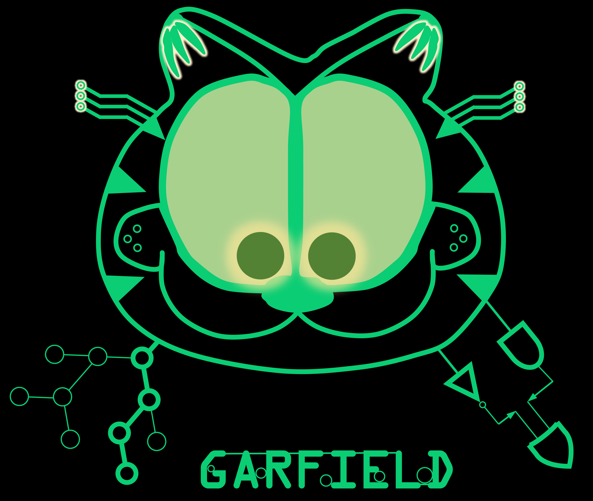

# Garfield
Short description


## Table of Contents
=================

- [Overview <a name="user\-content\-workflow"></a>](#project-overview)
- [Installation <a name="user\-content\-install"></a>](#installation)
- [Usage](#usage)
- [Contributing](#contributing)
- [License](#license)
- [Contact](#contact)

## Project Overview <a name="workflow"></a>

Garfield - Genetic Association by Random Forest and InterpretivE Logic Decisions, helps to identify genetic heterogeneity and various interaction effects.


## Installation <a name="install"></a>

Provide instructions on how to install and set up the project locally. Include any dependencies or prerequisites that need to be installed.
### Installation via `conda` [recommended]


### Installation of dependencies step by step

Download the lastest version:

```
```

1. Perl packages:
  
    ```
2. R packages
    ```

## Preparation of input files <a name="input"></a>

## Usage by examples
```bash
```
# Case1: gene-based
$ command 1


Here is an example:

```
Garfield 
```

Options
    -help | -h
            Prints the help message and exits.

    --input [required]
           - RDS files. <fig1.rds,fig2.rds...>

    --labels [optional]
           - Labesl for each figure. Default: <A,B,C,D...>

    --output [optional]
           - Output files for the graph. Default: cowplot_mer_fig.pdf

    --ncol [optional]
           - Number of columns on the graph.

    --base_height [optional]
           - The height (in inches) of each sub-plot

    --base_aspect_ratio [optional]
           -  The aspect ratio of each sub-plot. Default: 1.6
```
```

# Case2: paralog-based
$ command 2

# Case3: potential synthetic associations
$ command 3

Please see details in [Document](http://xxx) websites.


Trait:
missing: NA,
negative: default is considered as NA, please specify --trait include_negative to keep these as normal trait values;

Best suggestion: removing all NAs, and keep the id of trait and plink genotypes in the same order.


plink --indiv-sort <mode name> [filename]
# This allows you to specify how samples should be sorted when generating new datasets. The four modes are:


genotype：no-missing 
/groups/nordborg/user/haijun.liu/software/plink2 --bfile cubicV3.maf0.02.chr1 --genotyping-rate should be 1.


## How to cite <a name="cite"></a>
A paper describing the current study is under preparation.


## Warranty and License
YOU ACKNOWLEDGE AND AGREE THAT THE SOFTWARE IS PROVIDED TO YOU ON AN "AS IS" BASIS, WITHOUT WARRANTY OF ANY KIND, EXPRESS OR IMPLIED. 
GARFIELD IS RELEASED UNDER THE GPLV3, WHICH IS PROVIDED IN A SEPARATE LICENSE FILE. BRIEFLY, IT ALLOWS USERS TO LEGALLY COPY, DISTRIBUTE, AND MODIFY. HOWEVER, ANY DISTRIBUTION OF DERIVATIVE CODE MUST ALSO BE OPEN SOURCE AND ABIDE BY THE SAME GPLV3 AGREEMENT.

## Contributing
If you have bugs, feature requests, please report the issues here: (https://github.com/heroalone/Garfield/issues).


## Contact
Dr. Haijun Liu (haijun.liu[at]gmi.oeaw.ac.at).
